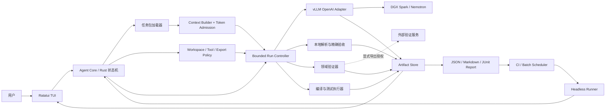
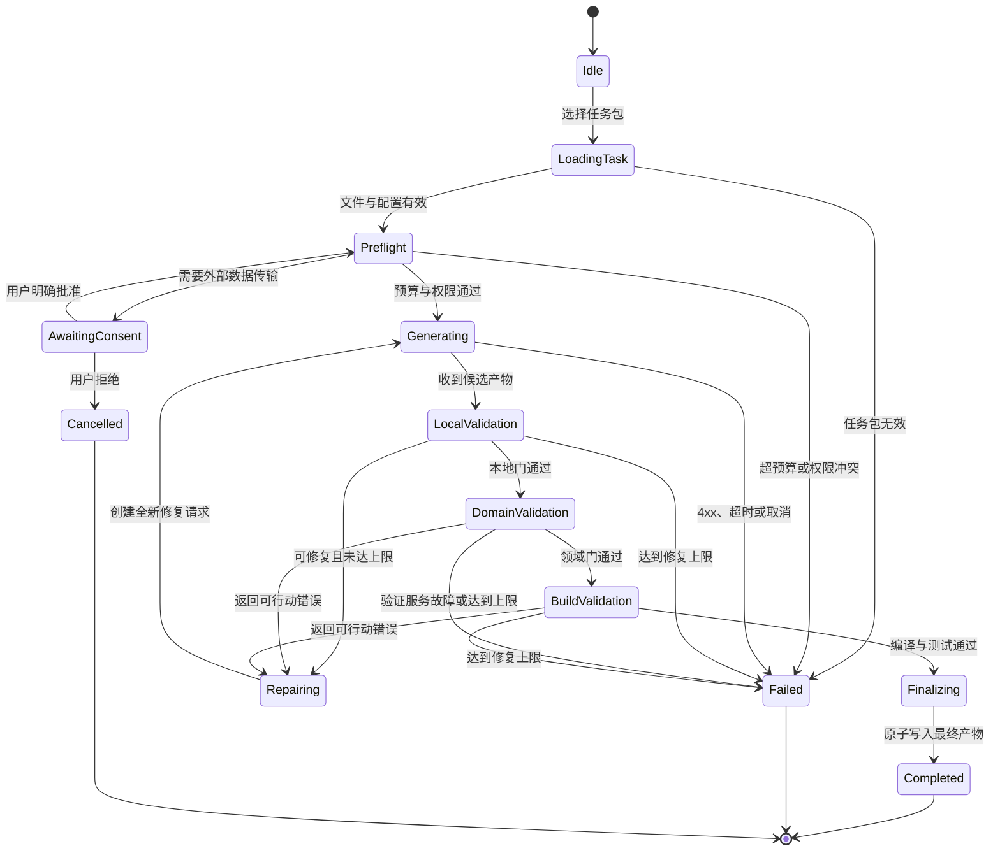

# DGX Spark 专用 Ratatui Coding Agent 设计概要

> 状态：设计草案
> 目标读者：Agent、Rust、平台工程与 DGX Spark 运维团队
> 设计依据：2026-07-24 至 2026-07-27 的 DGX Spark、MiMoCode、
> Python 编排、TeaQL 验证与 30 对象建模实测记录

> **产品使命：打造一个面向组织内网、隔离网络和私有研发环境的
> Compliance-by-Design Coding Agent。代码、提示词、模型输入、构建产物和审计
> 证据默认留在组织控制域内；每一次访问、执行、修改和外部传输都可授权、可限制、
> 可追溯、可复核。**

## 1. 执行摘要

我们需要设计的不是另一个通用 Coding Agent，而是一个针对 DGX Spark
本地模型约束优化、以合规内网应用为首要目标的工程控制器：

- 使用 `ratatui` 提供可观察、可取消、可审计的终端界面。
- 使用 Rust 状态机决定模型何时可以读取、生成、验证、修复和结束。
- 使用 DGX Spark 上的 vLLM 服务执行推理。
- 支持完全离线、受控内网和受限外联三种部署模式。
- 内网位置不产生隐式信任；用户、设备、模型服务和工具仍需认证与授权。
- 使用显式任务包构造小而确定的上下文，不把整个仓库交给模型探索。
- 使用宿主侧白名单限制文件、命令和外部数据传输，不能依赖提示词禁令。
- 使用确定性验证器判定结果，模型本身无权宣布任务成功。
- 每次生成或修复都是独立、无状态请求；不自动 checkpoint、不恢复长会话。
- 默认最多执行一次首次生成和一次修复，禁止无边界循环。
- 只有全部验收门通过后，才形成最终产物。

这套 Agent 的核心价值不是“更自主”，而是“在 64K 本地模型和组织内网中更可控、
更小、更容易证明执行边界和结果正确性”。

项目第一阶段的第一优先级不是扩展 Agent 功能，而是自动评估运行在 DGX Spark
上的模型是否真正可用于 Coding Agent 工作流。测试必须能够在预检完成后无人值守地
连续执行生成、验证、修复、编译、测试和报告步骤。Ratatui 是观察与控制界面，
headless runner 是自动化执行入口，两者必须共享同一个 Agent Core 和状态机。

本文中的“合规”是工程能力目标，不是认证结论。最终是否满足《个人信息保护法》、
《数据安全法》、等保、行业监管或组织制度，仍需由数据处理者、法务、安全与审计
团队结合部署范围和实际数据完成评估。

## 2. 已验证事实

以下事实来自当前仓库中的执行台账、远程快照和流水线运行记录。

| 项目 | 已验证结果 | 对设计的影响 |
|---|---|---|
| DGX 服务 | `nemotron-3-super`，vLLM OpenAI-compatible API | 首期只需要实现 OpenAI Chat Completions 适配器 |
| 上下文窗口 | 65,536 tokens | 必须在调用前执行 admission control |
| 服务并发 | `max-num-seqs=1` | Agent 默认只允许一个在途生成请求 |
| MiMoCode 基础开销 | 简单任务首轮约 24K input tokens | 通用 Agent 的系统提示词和工具 Schema 对本地模型过重 |
| MiMoCode 越界 | 57,345 input + 8,192 output = 65,537 | 必须把输入、输出和安全余量作为一个整体预算 |
| MiMoCode 重试风暴 | 10,241 个 HTTP 400；checkpoint 子会话失控 | 4xx 不重试；禁止自动 checkpoint 和无限恢复 |
| 工具禁令可靠性 | 即使提示词禁止，仍可能调用 `skill_search` | 工具权限必须在宿主侧强制执行 |
| 退出可靠性 | 文件写入后客户端可能不自然退出 | 完成条件由状态机和 watchdog 决定 |
| Python 三对象直连 | 335 prompt + 138 completion，10.155 秒 | 小型无状态请求能够显著降低开销 |
| 三对象 TeaQL | 0 errors，10 warnings，10 solids | “最小语法示例 + 值形式白名单”有效 |
| 30 对象修复 | 3,981 prompt + 2,027 completion，127.399 秒 | 复杂模型也可以在一次有界修复内完成 |
| 30 对象 TeaQL | 0 errors，141 warnings，6 suggestions，67 solids | Python 式有界编排可扩展到中等复杂度任务 |
| 30 对象关系 | 34 条关系全部由 TeaQL 解析 | 精确验收和领域验证必须同时存在 |

由此得到的主要结论是：

1. DGX Spark 上的模型具备完成目标任务的能力。
2. 失败主要来自通用 Agent 的上下文、工具、checkpoint 和生命周期管理。
3. 提示词优化有价值，但不能替代客户端级硬边界。
4. 最可靠的路径是小上下文、无状态生成、确定性验证和有界修复。

## 3. 产品目标

### 3.1 第一阶段：DGX 模型可用性自动评估

- 把“DGX Spark 上的模型是否可用”作为最高优先级问题。
- 建立可重复运行的自动测试矩阵，而不是依赖人工聊天判断模型能力。
- 一次性加载测试计划和预授权策略，随后无人干预地执行多个步骤。
- 自动执行模型调用、产物解析、精确验收、领域验证、修复、编译、测试和报告。
- 同时提供 Ratatui 观察模式和 headless/batch 执行模式。
- 每个测试都有 timeout、请求次数、修复次数和资源预算硬上限。
- 自动保存 pass@1、repair pass、耗时、token、吞吐、错误分类和终态。
- 测试失败后继续执行计划中相互独立的后续用例，最终形成完整矩阵报告。
- 提供默认不出网、可在隔离内网运行的评估系统。
- 对用户身份、角色、设备、workspace、模型、工具和导出目标执行显式授权。
- 对每次模型请求、文件读取、候选修改、命令执行、授权和最终写入形成不可抵赖性
  所需的审计证据。
- 支持组织配置数据分级、保留期限、脱敏、删除和外部传输策略。
- 在 TUI 中创建、加载和检查显式任务包。
- 调用 DGX Spark vLLM 完成建模或边界明确的代码生成。
- 在调用前显示精确或保守的 token 预算。
- 对模型输出执行本地语法、任务验收、领域验证、编译和测试。
- 在验证失败时创建一个全新的修复请求。
- 保存完整请求、响应、耗时、token、日志、差异和最终产物。
- 支持用户随时取消正在运行的请求。
- 严格限制模型可访问的文件和可运行的命令。

### 3.2 第二阶段及后续产品目标

- 只有第一阶段证明模型满足可用性门槛后，才扩展生产 Coding Agent 能力。
- 支持 Rust、Python、配置文件和 XML 的受控 patch 工作流。
- 支持多个可组合工作流，例如：
  - KSML 建模
  - TeaQL 代码生成
  - `cargo check`
  - `cargo test`
  - 编译错误修复
  - 小范围代码评审
- 支持不同 DGX 模型配置文件，但不把所有模型假设塞进核心提示词。
- 支持离线验证器和组织内部验证服务。

### 3.3 非目标

- 不宣称仅因部署在内网就自动满足任何法律、标准或认证。
- 不把网络边界当作唯一身份与访问控制。
- 不追求无限自主运行。
- 不允许模型自行递归扫描整个仓库。
- 不实现自动 checkpoint、长会话压缩或任意 resume。
- 不默认开放任意 shell。
- 不通过增加大量工具 Schema 来模拟市场上的通用 Coding Agent。
- 不把“模型声称完成”视为成功。
- 不在没有明确授权时向第三方服务发送代码或模型文件。

### 3.4 第一阶段的“可用”定义

模型可用性不是 endpoint 返回 HTTP 200，而是以下能力组合：

| 维度 | 可机器检查的定义 |
|---|---|
| Service readiness | 模型、context、profile 和 tokenizer 信息可获取 |
| Transport | 请求在 timeout 内返回有效 JSON 和 token usage |
| Completion lifecycle | 有明确 `finish_reason`，客户端自然结束且无残留子任务 |
| Instruction adherence | 不产生范围外对象、文件、字段或动作 |
| Artifact validity | 输出可解析并满足精确 acceptance spec |
| Domain validity | TeaQL 或对应领域验证器返回 0 errors |
| Repairability | pass@1 失败时，在规定次数内基于确定性错误修复成功 |
| Buildability | 生成代码或目标 workspace 可以编译 |
| Runtime correctness | 选定测试或场景验证通过 |
| Resource safety | 无上下文越界、重试风暴、日志风暴和无界运行 |

第一阶段报告至少包含：

- endpoint success rate
- pass@1 rate
- pass-after-repair rate
- build pass rate
- test pass rate
- timeout、hang、context overflow 和 invalid-output rate
- prompt/completion token 的 p50、p95 和最大值
- latency 与 output tokens/second
- 每个 failure stage 和可复现 artifact

项目应为每种工作流设定独立门槛，不能用一个缺乏解释力的总分掩盖关键失败。

## 4. 设计原则

### 4.1 控制权属于宿主程序

模型只能提出产物或有限动作，Rust 控制器负责：

- 判断文件是否可读。
- 判断目标路径是否可写。
- 判断命令是否在模板白名单中。
- 判断是否满足上下文预算。
- 判断验证是否通过。
- 判断是否进入修复。
- 判断任务何时结束。

提示词中的“禁止搜索”“只读取这些文件”属于辅助说明，不是安全边界。

### 4.2 每轮无状态

首次生成和修复不能共享不断增长的消息历史。

首次请求只包含：

- 核心系统提示词
- 当前工作流规则
- 任务
- 最小合法示例
- 值或 API 白名单

修复请求重新构造，只包含：

- 同一任务包
- 被拒绝的候选产物
- 截断后的确定性诊断

### 4.3 验证器拥有最终裁决权

成功条件必须是机器可检查的门：

- 文件可解析。
- 产物满足精确任务规格。
- 领域验证器无错误。
- 生成代码可编译。
- 相关测试通过。

不同工作流可以启用不同门，但不能由模型自行跳过。

### 4.4 失败必须有界

- 默认首次生成 1 次。
- 默认修复最多 1 次。
- 配置上限不得超过 3 次修复。
- HTTP 4xx 不重试。
- HTTP 5xx 或网络瞬断最多进行一次可配置重试。
- 验证服务没有返回可行动的错误信息时停止，不把基础设施错误交给模型修复。

### 4.5 默认最小权限

- 默认不开放 shell。
- 默认不递归搜索。
- 默认不允许读写任务清单之外的路径。
- 默认不允许外部数据传输。
- 默认不允许子 Agent。
- 默认串行推理。

## 5. 总体架构



### 5.1 推荐部署方式

首选方式是让 Agent 运行在开发工作站，DGX Spark 只承担模型推理：

```text
Developer Workstation
├── Ratatui Agent
├── source workspace
├── validators / Cargo / tests
└── artifact store
        │ private OpenAI-compatible request
        ▼
DGX Spark
└── vLLM + Nemotron
```

这样可以避免把代码仓库、构建工具和凭据复制到 DGX。Agent 也可以在 DGX
本机运行，但应视为次选部署模式，并使用相同的 workspace policy。

Ratatui 和 headless runner 只能是两个前端，不能各自实现一套执行逻辑。自动评估、
交互观察和将来的生产 Agent 必须复用相同 reducer、policy engine、validator 和
artifact schema，避免“界面测试通过、批处理行为不同”。

## 6. 运行状态机



状态机必须是显式 enum，不能通过日志文本猜测当前状态。

在 unattended evaluation 模式中，`AwaitingConsent` 不能等待人工输入。所有可能的
外部传输、workspace 和工具权限必须在批次启动前通过已签名的 test plan 和 policy
完成预授权。运行中出现计划外动作时直接进入 `Failed` 或 `SkippedByPolicy`，不得
暂停整个批次等待操作员。

## 7. 上下文预算

### 7.1 DGX 64K 默认预算

| 区域 | 默认上限 |
|---|---:|
| Prompt admission limit | 48,000 tokens |
| Completion limit | 4,096 tokens |
| Agent safety reserve | 8,192 tokens |
| Agent 使用上限 | 60,288 tokens |
| 服务额外余量 | 5,248 tokens |
| vLLM 硬上限 | 65,536 tokens |

必须满足：

```text
prompt_tokens + max_completion_tokens + safety_reserve
    <= configured_agent_limit
    < model_context_limit
```

不能只检查当前输入是否小于 65,536，因为 MiMoCode 的实测故障正是输入本身合法，
但加上请求输出后越界一个 token。

### 7.2 Token 计算

优先级：

1. 调用 vLLM 暴露的兼容 tokenizer endpoint，并使用实际 chat template。
2. 在工作站加载与服务一致的 tokenizer。
3. tokenizer 不可用时，使用保守字节估算，并扩大安全余量。

如果无法证明预算安全，状态机停在 `Preflight`，不得“先试试看”。

### 7.3 Prompt 构成目标

- 核心系统提示词目标：小于 2K tokens。
- 工作流规则按需加载，不注册无关工具。
- 示例只提供一个最小合法示例。
- 不附加整个仓库树。
- 不重复发送已知文件。
- 诊断默认最多 12K characters，并优先提取 error 部分。

## 8. 任务包

每个任务使用一个显式目录，例如：

```text
task-package/
├── task.md
├── grammar-example.xml
├── value-whitelist.txt
├── acceptance.json
├── workspace-manifest.toml
└── tool-policy.toml
```

### 8.1 `task.md`

描述业务目标、目标文件和明确范围。复杂需求必须先收敛为确定对象、模块或文件清单，
不能把宽泛产品描述直接交给模型自由扩展。

### 8.2 `grammar-example.xml`

只提供一个与业务无关的最小合法示例。实测中：

- 只有约束时，TeaQL 得到 15 errors。
- 增加最小语法示例后，降低到 1 error。
- 再增加值形式白名单后，降低到 0 errors。

### 8.3 `value-whitelist.txt`

只允许当前服务和验证器确认支持的形式。未经验证的类型不能因为模型“看起来熟悉”
就自动加入。

### 8.4 `acceptance.json`

定义可机器检查的任务完成条件，例如：

- 根属性。
- 精确对象或目标文件清单。
- 必需字段和引用。
- 是否允许额外字段。
- 公共版本和软删除字段。
- 对象所属模块。

### 8.5 `workspace-manifest.toml`

定义：

- 可读文件。
- 可写文件。
- 禁止路径。
- 单文件与总读取字节上限。
- 是否允许递归目录列表。

### 8.6 `tool-policy.toml`

定义允许的确定性命令模板和参数约束。模型不能把任意字符串直接交给 shell。

## 9. 模型适配器

### 9.1 首期接口

首期只支持：

```text
POST /v1/chat/completions
```

默认参数：

```json
{
  "model": "nemotron-3-super",
  "temperature": 0.0,
  "top_p": 1.0,
  "max_tokens": 4096,
  "chat_template_kwargs": {
    "enable_thinking": false
  }
}
```

默认关闭 thinking 的原因：

- 建模任务已经通过无 thinking 模式验证。
- 可以避免额外 reasoning token 开销。
- 产物正确性由外部验证器判断。

后续可以对特定代码任务启用有限 reasoning budget，但必须计入同一上下文预算。

### 9.2 响应处理

适配器需要分别记录：

- `message.content`
- `message.reasoning_content`
- `finish_reason`
- `usage.prompt_tokens`
- `usage.completion_tokens`
- 请求耗时
- HTTP status

只有 `finish_reason=stop` 且产物可解析时才进入验证。`length`、空内容或不完整
结构应作为失败处理。

### 9.3 模型配置文件

模型差异使用 profile，而不是污染核心提示词：

```text
profiles/
├── dgx-spark-nemotron-3-super-64k.toml
├── dgx-spark-qwen-coder-64k.toml
└── test-mock.toml
```

Profile 包含：

- endpoint
- model id
- context size
- completion cap
- concurrency
- thinking 配置
- tokenizer 配置
- transport timeout

## 10. Coding Agent 工具模型

### 10.1 首期策略：产物优先

模型不直接调用工具。模型返回：

- 完整 XML
- 完整目标文件
- 或受限 patch

宿主程序再执行写入、验证、编译和测试。这是当前 Python 流水线已经验证的模式。

### 10.2 后续受控工具

工具分为三类：

1. Workspace 工具
   - 读取清单中的文件
   - 读取指定行范围
   - 写入指定候选路径
   - 应用受限 patch
2. Deterministic validation 工具
   - XML parse
   - TeaQL evaluate
   - `cargo check`
   - `cargo test`
   - formatter
3. Observability 工具
   - 服务健康
   - token 预算
   - GPU/请求状态

首期不提供 `bash(command: String)` 形式的任意工具。

### 10.3 命令模板

允许：

```text
cargo check --manifest-path <approved-manifest>
cargo test --manifest-path <approved-manifest> <approved-test-filter>
cargo teaql evaluate --input <candidate>
```

禁止：

- 管道与 shell control operators。
- 未解析环境变量。
- 未经批准的 glob。
- 网络下载命令。
- 递归删除。
- 写入 workspace 之外的目标。

## 11. 验证与修复阶梯

| Level | 验证门 | 失败处理 |
|---|---|---|
| L0 | HTTP、JSON、`finish_reason` | 传输失败；不交给模型修复 |
| L1 | 文件格式解析 | 将解析错误放入修复诊断 |
| L2 | 精确任务验收 | 将缺失/额外对象、字段、文件放入诊断 |
| L3 | 领域验证 | 只发送 error 与必要上下文 |
| L4 | 代码生成 | 保存生成器日志 |
| L5 | 编译 | 发送截断后的 compiler errors |
| L6 | 测试 | 发送失败断言与相关文件 |

### 11.1 修复请求

修复请求必须：

- 是一个新请求。
- 重复发送短任务包，而不是完整会话。
- 包含完整候选产物。
- 只包含可行动的错误。
- 明确要求输出完整修复产物。
- 不自动加入 warning，除非工作流配置要求 warning budget。

### 11.2 基础设施错误

以下错误不可触发模型修复：

- DNS 失败。
- 验证服务 5xx。
- 验证服务没有返回 error count。
- 凭据失效。
- 工具进程不存在。
- 用户取消。

### 11.3 外部验证授权

如果验证器会向外部服务发送产物，状态机必须：

1. 显示目标域名。
2. 显示文件清单和总字节数。
3. 请求针对本次运行的明确授权。
4. 保存授权事件，但不保存敏感凭据。
5. 未授权时允许本地门继续，但明确标记“external validation pending”。

## 12. Ratatui 交互设计

### 12.1 主界面

```text
┌ DGX Agent ─ Model: nemotron-3-super ─ 64K ─ In-flight: 0/1 ─────────┐
│ Run: moving-company-30                  State: DomainValidation      │
├ Task / Files ───────────────┬ Candidate / Diff ─────────────────────┤
│ ✓ task.md                   │ + <audit_log ...>                     │
│ ✓ grammar-example.xml       │ ~ _module_key="employees-payroll"     │
│ ✓ value-whitelist.txt       │                                      │
│ ✓ acceptance.json           │                                      │
├ Pipeline ───────────────────┼ Diagnostics ──────────────────────────┤
│ ✓ Preflight                 │ TeaQL: 0 errors                       │
│ ✓ Generate     127.4s       │ Warnings: 141                         │
│ ✓ Local Gate   0 errors     │ Suggestions: 6                        │
│ ▶ TeaQL                     │ Relations resolved: 34/34             │
│ ○ Build                     │                                      │
├ Tokens ─────────────────────┴───────────────────────────────────────┤
│ Prompt 3,981 / 48,000 | Completion 2,027 / 4,096 | Reserve 8,192   │
├ [g] Run  [v] Validate  [r] Repair  [c] Cancel  [d] Diff  [q] Quit ┤
└─────────────────────────────────────────────────────────────────────┘
```

### 12.2 主要视图

- Run
  - 当前状态
  - 各阶段耗时
  - token 使用
- Task
  - 任务包文件
  - workspace manifest
  - 权限摘要
- Candidate
  - 候选产物
  - 与原文件 diff
- Validation
  - error、warning、suggestion、solid 分类
  - 可行动错误摘要
- History
  - 每次独立请求
  - 修复次数
  - 请求与产物 hash
- Config
  - 模型 profile
  - 预算
  - timeout
  - 外部服务策略

### 12.3 用户操作

- 所有破坏性操作需要确认弹窗。
- 写入最终文件前显示目标路径。
- 向外部验证器发送文件前显示 consent dialog。
- `Cancel` 必须立即触发 cancellation token，不等待生成自然结束。
- TUI 退出不能杀死已保存的历史；未完成运行标记为 interrupted。
- interrupted 运行不能自动 resume，只能基于已保存候选创建新运行。

### 12.4 Headless 与无人值守模式

第一阶段必须提供 headless CLI，例如：

```bash
dgx-agent evaluate \
  --plan benchmarks/availability-suite.toml \
  --profile dgx-spark-nemotron-3-super-64k \
  --policy policies/evaluation-signed.toml \
  --output runs/availability-2026-07-27 \
  --report json,junit,markdown
```

执行规则：

- 启动前完成全部 task、policy、token、endpoint 和 export preflight。
- 启动后自动推进状态机，不出现需要人工回答的中间问题。
- 独立用例失败不阻止其余独立用例运行。
- 同一用例内部按照工作流自动执行生成、验证、修复、编译和测试。
- 未预授权动作直接拒绝，并记录 `SkippedByPolicy` 或 `Failed`。
- 进程以稳定 exit code 表示 suite 通过、测试失败、策略拒绝或基础设施失败。
- 支持 JSON、Markdown 和 JUnit 报告，便于 CI 和历史趋势分析。
- Ratatui 可以只读打开正在运行或已完成的 run directory，不改变批处理语义。

无人值守不等于无限自治。自动化只发生在预先声明且有硬边界的测试图内。

## 13. Rust 工程结构

推荐使用 Cargo workspace：

```text
dgx-spark-agent/
├── Cargo.toml
├── apps/
│   ├── dgx-agent-tui/
│   │   └── src/
│   │       ├── main.rs
│   │       ├── app.rs
│   │       ├── ui.rs
│   │       ├── input.rs
│   │       └── views/
│   └── dgx-agent-cli/
│       └── src/
│           └── main.rs
├── crates/
│   ├── agent-core/
│   │   └── src/
│   │       ├── state.rs
│   │       ├── event.rs
│   │       ├── reducer.rs
│   │       ├── run_controller.rs
│   │       └── workflow.rs
│   ├── model-vllm/
│   │   └── src/
│   │       ├── client.rs
│   │       ├── chat.rs
│   │       ├── tokenizer.rs
│   │       └── profile.rs
│   ├── context-builder/
│   ├── workspace-guard/
│   ├── tool-runner/
│   ├── validation/
│   └── artifact-store/
└── profiles/
```

### 13.1 建议依赖

| 能力 | Crate |
|---|---|
| TUI | `ratatui`, `crossterm` |
| Async runtime | `tokio` |
| HTTP | `reqwest` |
| Serialization | `serde`, `serde_json`, `toml` |
| CLI | `clap` |
| Error handling | `thiserror`, `anyhow` |
| Cancellation | `tokio-util` |
| XML | `quick-xml` |
| Diff | `similar` |
| Logging | `tracing`, `tracing-subscriber` |
| IDs and timestamps | `uuid`, `chrono` |
| Hashing | `sha2` |
| Temporary candidates | `tempfile` |

依赖版本应在开始实现时依据当前 Rust toolchain 和 crates.io 官方信息确认。

## 14. Core 数据结构草案

```rust
enum PipelineState {
    Idle,
    LoadingTask,
    Preflight,
    AwaitingConsent,
    Generating { attempt: u8 },
    LocalValidation { attempt: u8 },
    DomainValidation { attempt: u8 },
    BuildValidation { attempt: u8 },
    Repairing { attempt: u8 },
    Finalizing,
    Completed,
    Failed,
    Cancelled,
}
```

```rust
struct ContextBudget {
    model_context: u32,
    prompt_limit: u32,
    completion_limit: u32,
    safety_reserve: u32,
    estimated_prompt: u32,
}

impl ContextBudget {
    fn admits(&self) -> bool {
        self.estimated_prompt
            + self.completion_limit
            + self.safety_reserve
            <= self.model_context
    }
}
```

```rust
enum RunEvent {
    TaskLoaded(TaskPackage),
    PreflightPassed(ContextBudget),
    ConsentGranted(ExportConsent),
    ModelStarted { attempt: u8 },
    ModelCompleted(ModelResult),
    ValidationCompleted(ValidationResult),
    RepairScheduled { attempt: u8 },
    FinalArtifactWritten(PathBuf),
    CancelRequested,
    Failed(AgentError),
}
```

TUI 不直接修改状态。所有输入和 worker 结果都变成 `RunEvent`，再由 reducer
产生新状态和副作用命令。

## 15. Async 与并发

### 15.1 UI 与 worker 分离

- Ratatui event loop 只负责绘制和发送事件。
- HTTP、验证、编译和测试在 Tokio task 或受控 blocking worker 中运行。
- worker 通过 bounded `mpsc` 发送结构化进度。
- 日志 channel 必须有容量限制，避免重试风暴再次耗尽内存。

### 15.2 DGX 并发

当前 Nemotron 服务 `max-num-seqs=1`，默认：

```text
model_request_concurrency = 1
```

验证和 UI 可以并行，但不能同时向模型发送多个请求。模型 profile 将来报告更高并发
前，不能自动提升。

### 15.3 Timeout

建议默认值：

```text
health_timeout = 10s
model_timeout = 300s
domain_validation_timeout = 120s
build_timeout = 300s
test_timeout = 300s
cancel_grace = 2s
```

复杂任务可以在 profile 中调整，但 TUI 必须显示实际 timeout。

## 16. Artifact 与可复现性

每次运行创建独立目录：

```text
runs/<run-id>/
├── run-config.json
├── task-package-manifest.json
├── events.jsonl
├── attempt-01/
│   ├── messages.json
│   ├── request.json
│   ├── response.json
│   ├── candidate
│   ├── local-validation.json
│   └── domain-validation.log
├── attempt-02/
├── final-artifact
└── summary.json
```

必须记录：

- run id
- Agent 版本与 Git commit
- 模型 profile
- endpoint path，但默认不保存凭据
- 模型和服务版本
- 上下文预算
- 请求 token 与完成 token
- 每阶段耗时
- `finish_reason`
- candidate 与 final hash
- 验证器版本和结果
- 修复原因
- 用户 consent 事件
- cancelled、failed 或 completed 终态

保存原始响应时需要配置数据保留策略，因为其中可能包含源代码或私有提示词。

## 17. 安全设计

### 17.1 合规边界与参考原则

产品以控制能力和审计证据支持组织合规，而不是在代码中硬编码某一套法律结论。
控制设计至少体现以下原则：

- 目的限定：每个任务包说明处理目的、数据范围和最终产物。
- 最小必要：只读取完成当前任务所需的文件和最少行范围。
- 数据分类分级：根据代码、配置、凭据、个人信息和重要数据等级决定模型与工具权限。
- 本地优先：模型推理、验证、artifact 和日志默认留在组织控制域。
- 明确授权：外部传输、扩大 workspace、运行高风险命令和覆盖文件需要独立授权。
- 可追溯：用户、设备、策略版本、输入、动作、结果和授权事件形成完整链路。
- 生命周期：数据具备保留期限、归档、删除和 legal hold 策略。
- 职责分离：普通开发者不能修改审计策略或导出白名单。

设计参考：

- [《中华人民共和国个人信息保护法》](https://www.npc.gov.cn/npc/c2/c30834/202108/t20210820_313088.html)
  所体现的合法、正当、必要、目的明确和最小范围原则。
- [《中华人民共和国数据安全法》](https://www.npc.gov.cn/npc/c2/c30834/202106/t20210610_311888.html)
  所要求的数据安全治理、分类分级与处理活动保护能力。
- [NIST SP 800-207 Zero Trust Architecture](https://csrc.nist.gov/pubs/sp/800/207/final)
  关于不能仅因网络位置而授予隐式信任的原则。
- [NIST SP 800-218 SSDF](https://csrc.nist.gov/pubs/sp/800/218/final)
  关于把安全实践整合进软件开发生命周期的框架。

这些参考用于控制映射，不表示产品已经通过等保、ISO、NIST 或其他认证。

### 17.2 威胁模型

首期至少防范：

- 恶意或被污染的仓库内容诱导 Agent 越权读取、执行或外传。
- Prompt injection 把文件内容伪装成系统指令。
- 内网账号、设备或服务被盗用。
- 模型生成危险命令、敏感信息或越界路径。
- Symlink、相对路径、环境变量和 glob 导致 workspace escape。
- 未认证的 vLLM endpoint 被非授权调用。
- 验证服务、依赖源或插件成为数据外传通道。
- 日志、raw response、崩溃转储或运行历史泄露代码和凭据。
- 重试风暴耗尽日志、磁盘、内存、GPU 或审计系统。
- 管理员通过修改策略删除或掩盖操作记录。

不应把模型输出、仓库文件、编译器诊断或工具返回值视为可信指令。

### 17.3 内网部署模式

| 模式 | 网络能力 | 默认策略 |
|---|---|---|
| Air-gapped | 无外网 | 本地模型、本地验证、本地依赖镜像；所有 export 拒绝 |
| Restricted intranet | 仅允许组织内服务 | endpoint、制品库、身份服务和验证器使用固定 allowlist |
| Controlled egress | 个别外部域名 | 每次导出显示域名、文件、字节数、目的并请求授权 |

`Air-gapped` 必须是完整功能模式，而不是无法验证或无法安装后的降级状态。发布包需要
支持离线安装、离线升级、内部 crates/vendor、内部模型和内部验证器。

### 17.4 身份、角色与职责分离

Agent 不能只信任当前 Unix 用户。企业部署应支持对接组织身份源，并至少区分：

| 角色 | 权限 |
|---|---|
| Developer | 创建任务、运行低风险工作流、查看自己的运行 |
| Reviewer | 审查 diff、验证结果并批准最终写入 |
| Security Approver | 批准数据导出、敏感仓库和高风险工具 |
| Policy Administrator | 管理已签名策略，但不能删除审计证据 |
| Auditor | 只读查看策略、事件、hash、授权和结果 |

关键原则：

- 认证与授权分别执行。
- 每次运行绑定用户和设备身份。
- 策略决策基于用户、角色、设备、仓库、数据等级、工具和目标资源。
- 高风险动作支持双人复核。
- 临时授权必须有范围、原因和过期时间。
- 本地管理员权限不能自动等于 Agent 的导出权限。

### 17.5 数据分类与流向

任务包在运行前标注数据等级，例如：

```text
PUBLIC
INTERNAL
CONFIDENTIAL
RESTRICTED
```

策略引擎据此决定：

- 哪个模型 endpoint 可以接收。
- raw request/response 是否可以落盘。
- TUI 是否显示完整内容。
- 哪些验证器可以使用。
- 是否允许复制、导出或遥测。
- 保留期限和删除方式。

TUI 应提供 Data Flow 视图：

```text
workspace files
→ context builder
→ DGX model endpoint
→ local artifact store
→ local validators
→ optional approved external validator
```

每条边显示数据等级、目标身份、传输协议、授权依据和保留策略。

### 17.6 Endpoint

- 不在代码中硬编码公网 IP。
- 使用 profile、环境变量或系统 keyring。
- 优先使用私网、SSH tunnel、VPN 或 source allowlist。
- vLLM 不应长期以未认证方式暴露在公网。
- Agent 与模型服务之间使用双向认证或等效的服务身份机制。
- 服务证书、模型版本和 endpoint policy 在运行记录中可验证。

### 17.7 Workspace

- canonicalize 所有路径。
- 拒绝 workspace root 之外的读写。
- 拒绝 symlink escape。
- 最终写入使用临时文件加原子 rename。
- 覆盖已有文件前显示 diff 并确认。
- 敏感文件使用 denylist 作为第二道保护，例如 `.env`、私钥、token cache 和凭据目录。
- 读取文件前记录 policy decision，不能只记录成功后的工具日志。

### 17.8 外部服务

- 数据传输 consent 必须按运行记录。
- 域名、文件和字节数必须可见。
- 不允许模型自行选择上传目标。
- 组织可配置 `external_exports = "deny"` 强制离线。
- 外部授权不能通过普通聊天提示词隐式获得。
- 允许域名还需要绑定证书身份、用途、数据等级和最大 payload。
- 未经组织批准的 telemetry、崩溃上报和更新检查全部关闭。

### 17.9 审计证据

- token、API key、magic link 和秘密字段在 TUI 与日志中脱敏。
- 不把完整请求自动发送到 telemetry。
- log rotation 需要硬上限。
- 重复错误聚合显示，例如：

```text
HTTP 400 context_length_exceeded × 847
```

不能为每次重复错误创建一条完整 assistant message。

审计记录还需要：

- Append-only 或等效防篡改存储。
- 事件序号、时间、actor、device、run id、策略版本和前后事件 hash。
- 请求与产物使用内容 hash，敏感内容可独立加密保存。
- 明确记录 allow、deny、cancel、override 和 consent。
- 审计保留策略独立于普通运行 artifact。
- 支持导出给审计系统，但导出本身也是受控事件。
- 时间源异常、日志写入失败或审计存储不可用时 fail closed。

### 17.10 密钥与凭据

- 凭据进入系统 keyring、TPM、HSM 或组织 secrets service，不进入任务包。
- 模型不能读取凭据值。
- 命令执行器使用短期、最小权限凭据。
- 日志脱敏在写入前完成，不能只在 TUI 显示时脱敏。
- 支持密钥轮换、吊销和 credential-use 审计。

### 17.11 软件供应链

- 发布二进制附带 SBOM、版本、构建来源和签名。
- Rust crates、模型、tokenizer、验证器和工作流模板使用固定版本与 hash。
- Air-gapped 模式从组织内部制品库更新。
- 插件默认禁用，安装需要签名、来源、权限清单和管理员批准。
- CI 执行依赖审计、许可证检查、静态分析、测试和可复现构建检查。
- 策略文件、模型 profile 和工作流模板也作为受签名供应链产物管理。

### 17.12 合规证据包

每个运行可以形成不包含明文源代码的证据包：

```text
compliance-evidence/
├── run-summary.json
├── actor-and-device.json
├── policy-decisions.jsonl
├── consent-events.jsonl
├── input-and-output-hashes.json
├── tool-executions.jsonl
├── validation-results.json
├── software-and-model-versions.json
└── evidence-signature.json
```

证据包用于证明“谁在何时依据哪条策略对哪些资源执行了什么动作并得到什么结果”，
而不是自动证明全部法律义务已经满足。

## 18. 配置草案

```toml
[model]
profile = "dgx-spark-nemotron-3-super-64k"
base_url_env = "DGX_AGENT_BASE_URL"
model = "nemotron-3-super"
context_tokens = 65536
max_prompt_tokens = 48000
max_completion_tokens = 4096
safety_tokens = 8192
concurrency = 1
thinking = false

[deployment]
mode = "restricted-intranet"
fail_closed = true
offline_updates = true

[identity]
provider = "enterprise"
require_device_identity = true
high_risk_requires_two_person_review = true

[data]
default_classification = "CONFIDENTIAL"
raw_prompt_retention = "organization-policy"
redact_before_log_write = true

[run]
max_repairs = 1
model_timeout_seconds = 300
validator_timeout_seconds = 120
diagnostic_character_limit = 12000
retry_http_4xx = false
retry_http_5xx = 1
automatic_resume = false
automatic_checkpoint = false

[evaluation]
unattended = true
continue_independent_tests = true
formats = ["json", "junit", "markdown"]
capture_pass_at_1 = true
capture_pass_after_repair = true
capture_latency_percentiles = true
capture_token_percentiles = true
unexpected_consent = "fail"

[workspace]
recursive_discovery = false
follow_symlinks = false
max_single_file_bytes = 180000
max_total_read_bytes = 500000

[exports]
external_validation = "ask"
allowed_domains = ["api.teaql.io"]
implicit_consent_from_prompt = false

[audit]
append_only = true
hash_chain = true
fail_closed = true
separate_retention_policy = true

[supply_chain]
require_signed_profiles = true
require_signed_workflows = true
require_sbom = true
plugins_default = "deny"

[artifacts]
root = ".dgx-agent/runs"
save_raw_response = true
max_log_bytes_per_run = 10485760
```

## 19. 分阶段路线

### 第一阶段：DGX 模型可用性自动评估

目标：

- 用 Rust 重写当前 Python bounded pipeline，作为自动评估核心。
- 提供共享 Agent Core 的 Ratatui 和 headless CLI。
- 从 suite plan 自动执行多个测试用例和多步骤工作流。
- 支持 XML/KSML 任务包。
- 支持本地 acceptance 和 TeaQL evaluate。
- 支持一次无状态修复。
- 自动执行可选代码生成、`cargo check` 和 `cargo test`。
- 无人工干预地生成 JSON、JUnit、Markdown 和 artifact 报告。
- Ratatui 展示 suite、状态、token、日志、指标和最终产物。
- 根据工作流分别报告 pass@1 和 pass-after-repair，不把 repaired pass
  错记为首次成功。

回归用例：

- 三对象 school-service：TeaQL 0 errors。
- 旧 MiMoCode 无效 XML：一次修复后 TeaQL 0 errors。
- 30 对象 moving-company：TeaQL 0 errors，34/34 references resolved。
- 上下文越界请求：preflight 自动拒绝，不调用模型。
- 模拟 HTTP 400：不重试且继续后续独立用例。
- 模拟 validator 基础设施故障：不触发模型修复。
- 模拟生成超时与取消：进入确定终态且无残留 worker。

第一阶段完成标准不是 TUI 能发出请求，而是自动评估报告能够回答：

- 这个模型在哪些 Coding Agent 工作流上可用？
- pass@1、修复后通过率、编译率和测试率是多少？
- 失败属于模型、上下文、协议、验证器还是生命周期管理？
- 在什么任务规模、token 和 timeout 范围内结果可重复？
- 是否能够整批无人值守完成而没有 hang、重试风暴或人工救援？

### 第二阶段：受控代码任务

目标：

- manifest 内文件读取。
- 单目标文件生成。
- patch 预览与应用。
- formatter、`cargo check` 和 `cargo test`。
- compiler-guided 一次修复。

### 第三阶段：工作流与 Profile

目标：

- 多模型 profile。
- 组织内部 validators。
- 可配置工作流模板。
- 运行历史检索和结果比较。
- benchmark 与 token/耗时趋势。

### 第四阶段：高级能力

只有在本地模型工具调用可靠性经过专项评估后才考虑：

- 多步 typed tool calling。
- 多文件 patch planning。
- 有界任务图。

即使进入第四阶段，也不默认支持长会话 checkpoint 或无限 Agent loop。

## 20. MVP 验收标准

### 功能

- 能加载任务包并显示所有输入文件。
- 能在调用前显示预算并拒绝越界请求。
- 能执行首次生成、本地验证、领域验证和一次修复。
- 能生成最终产物和完整 summary。
- 能取消模型和验证任务。
- 能显示 candidate 与 final diff。

### 自动评估

- headless runner 与 Ratatui 使用同一个 Agent Core 和状态机。
- 一个 suite 可以包含多个独立用例和每个用例内的多个连续步骤。
- preflight 通过后，整批测试无需人工输入即可运行到确定终态。
- 生成、解析、验收、领域验证、修复、编译、测试和报告可自动衔接。
- 未预授权动作不会弹出等待窗口，而是自动拒绝并继续可独立执行的用例。
- pass@1 与 pass-after-repair 分开记录。
- JSON、JUnit 和 Markdown 报告中的状态与 artifact 一致。
- timeout、HTTP 400、validator 故障和 context overflow 都有自动回归用例。
- suite 结束后不存在残留模型请求、worker 或子进程。

### 安全

- 支持 Air-gapped 模式，且核心生成、验证、修复和审计能力可用。
- 每个运行绑定用户、设备、策略版本和数据等级。
- 内网位置不能绕过身份认证和资源授权。
- 无法读取 manifest 外文件。
- 无法写入 workspace 外路径。
- 无法执行未注册命令。
- 未授权时无法调用外部验证服务。
- API key 不进入 artifact 或 TUI 明文。
- 审计存储不可用时高风险动作 fail closed。
- 发布包提供 SBOM、签名和固定依赖/模型 hash。

### 合规证据

- 每个访问和命令都有 allow/deny policy decision。
- 每次外部传输记录目的、域名、文件、字节数、数据等级和审批人。
- 能生成不包含明文代码的签名证据包。
- 保留、删除、归档和 legal hold 策略可配置并可审计。
- Reviewer、Security Approver、Policy Administrator 和 Auditor 职责可分离。

### 可靠性

- HTTP 4xx 不重试。
- 相同错误被聚合，不产生消息风暴。
- 任意运行最多创建 `1 + max_repairs` 个模型请求。
- validator 基础设施失败不会触发模型修复。
- TUI 退出或崩溃后，运行记录仍可读取。

### 性能

- 核心系统提示词小于 2K tokens。
- 默认 Agent 请求使用量不超过约 60K tokens。
- TUI 在模型生成期间保持响应。
- `Cancel` 在 2 秒内进入取消状态。

## 21. 需要继续验证的问题

1. vLLM 当前部署是否提供与 chat template 完全一致的 tokenize endpoint。
2. Nemotron 对统一 JSON patch envelope 的稳定性。
3. 在何种代码任务上需要启用 thinking，以及合理的 reasoning budget。
4. richer KSML scalar value forms 的正式白名单。
5. TeaQL 是否可以部署组织内部或完全离线的 evaluate 服务。
6. 如何在不增加巨大工具 Schema 的情况下支持多文件代码修改。
7. 30 对象模型中的多个独立领域根是否需要引入平台或公司根对象。
8. privacy masking、`_log="true"` 和服务命名 warning 是否应成为组织级硬门。

## 22. 当前设计决策

| 决策 | 当前选择 |
|---|---|
| 产品使命 | 面向内网和隔离研发环境的 Compliance-by-Design Coding Agent |
| 第一阶段最高优先级 | 自动评估 DGX Spark 模型对 Coding Agent 工作流的可用性 |
| 第一阶段执行要求 | 预检后多步骤、整批无人值守运行 |
| 执行前端 | Ratatui 观察控制 + Headless/CI 自动执行，共享同一 Agent Core |
| 合规声明 | 提供控制与证据，不自动宣称认证合规 |
| 部署模式 | Air-gapped、受控内网、受限外联 |
| 信任模型 | 内网不产生隐式信任；身份与资源逐次授权 |
| UI | `ratatui` |
| 实现语言 | Rust |
| 模型协议 | OpenAI-compatible Chat Completions |
| 默认模型 | DGX Spark `nemotron-3-super` |
| 默认上下文 | 64K |
| 默认并发 | 1 |
| 默认 thinking | 关闭 |
| 默认修复次数 | 1 |
| 会话策略 | 每轮无状态 |
| checkpoint | 禁止 |
| 自动 resume | 禁止 |
| 工具权限 | 宿主侧白名单 |
| 任意 shell | 首期禁止 |
| 成功判定 | 确定性验证器 |
| 外部验证 | 交互模式逐次授权；无人值守模式使用已签名的批次预授权 |
| 默认数据流 | 留在组织控制域 |
| 审计 | Append-only、hash chain、fail closed |
| 供应链 | 签名、SBOM、固定版本与 hash |
| 最终写入 | 全部门通过后原子写入 |

## 23. 总结

DGX Spark 专用 Coding Agent 的首要目的，是在组织内网和隔离研发环境中提供一个
Compliance-by-Design 的代码工程控制器。它既要围绕本地模型的现实约束设计，也不能
因为服务位于内网就放弃身份、最小权限、数据治理、审计和供应链控制。

第一阶段首先回答模型是否可用，而不是先堆叠生产功能。评估系统必须能够依据预先
声明的 suite 和 policy，在没有人工干预的情况下完成多步骤测试并产生可复现报告。
Ratatui 和 headless runner 共享同一状态机，确保人工观察不会成为测试成立的前提。

已经完成的 Python 流水线证明了核心路径：

```text
小型显式任务包
→ 上下文准入
→ 无状态 DGX 推理
→ 确定性验证
→ 一次全新修复
→ 最终产物
```

Ratatui/Rust 版本的任务，是把这条已经验证的路径产品化：让每一个状态、预算、权限、
外部传输、错误和最终结果都对用户可见并由程序强制执行。
